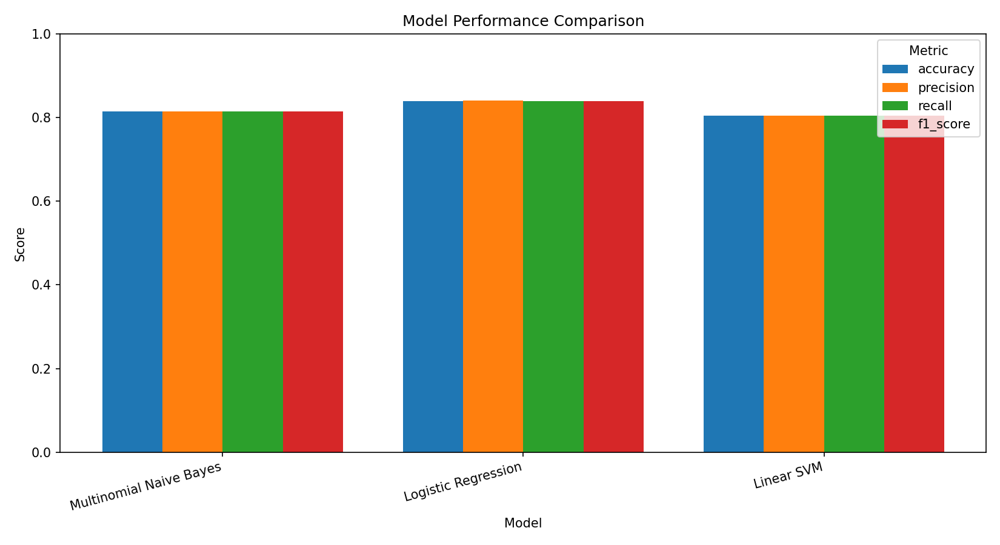
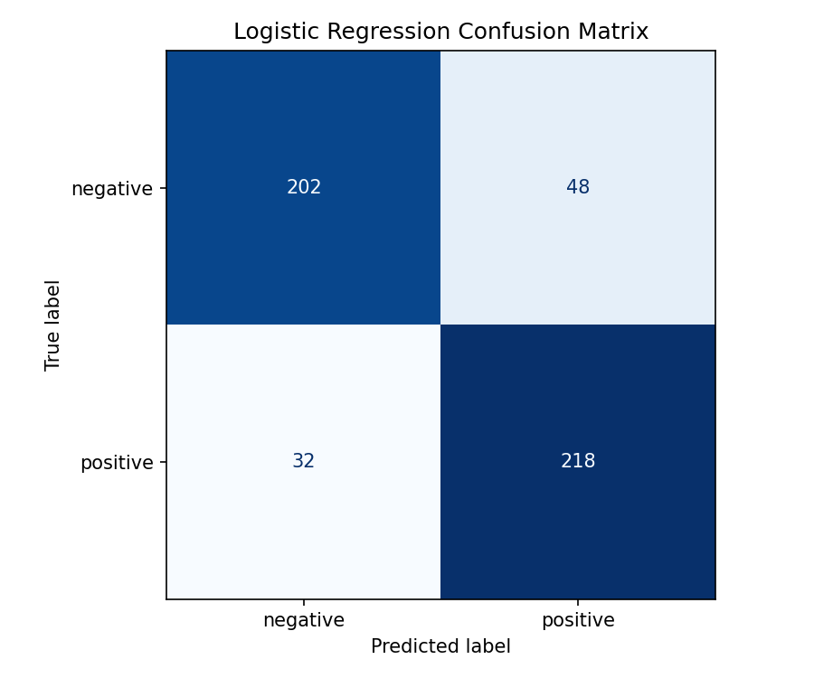

# ReviewMind

ReviewMind is a beginner-friendly Natural Language Processing (NLP) project for sentiment analysis of user reviews.  
The current focus is building a clean and reproducible baseline pipeline on real IMDb movie review data, then expanding toward stronger models and a simple interactive app.

## Project Overview

ReviewMind helps you learn and practice the end-to-end workflow for text classification:

1. Prepare and balance a real-world sentiment dataset (IMDb)
2. Preprocess review text into model-ready features
3. Train a baseline model (TF-IDF + Logistic Regression)
4. Evaluate results with standard classification metrics
5. Extend the project with deeper analysis, better models, and deployment

This repository is organized so beginners can run each step locally and understand the full machine learning pipeline.

## Current Project Structure

```text
Reviewmind/
├── README.md
├── requirements.txt
├── .gitignore
├── LICENSE
├── data/
│   ├── raw/
│   │   └── .gitkeep
│   └── processed/
│       ├── .gitkeep
│       └── processed_reviews.csv
├── notebooks/
│   └── .gitkeep
├── src/
│   ├── .gitkeep
│   ├── data_preprocessing.py
│   ├── prepare_imdb_dataset.py
│   └── train_ml.py
├── outputs/
│   ├── figures/
│   │   └── .gitkeep
│   └── models/
│       └── .gitkeep
└── app/
    └── .gitkeep
```

## Local Setup (Windows PowerShell)

> Tested as a standard local workflow using Python virtual environments.

1. **Clone the repository**

   ```powershell
   git clone https://github.com/<your-username>/Reviewmind.git
   cd Reviewmind
   ```

2. **Create a virtual environment**

   ```powershell
   python -m venv .venv
   ```

3. **Activate the virtual environment**

   ```powershell
   .\.venv\Scripts\Activate.ps1
   ```

   If PowerShell blocks activation, run this once in PowerShell as Administrator:

   ```powershell
   Set-ExecutionPolicy RemoteSigned
   ```

4. **Install dependencies**

   ```powershell
   pip install --upgrade pip
   pip install -r requirements.txt
   ```

## Prepare the IMDb Dataset

Use the dataset preparation script to build a balanced local subset:

- **Total samples:** 2,500
- **Negative reviews:** 1,250
- **Positive reviews:** 1,250

Run:

```powershell
python src/prepare_imdb_dataset.py
```

The script prepares a balanced IMDb sentiment dataset for training and evaluation.

## Train the Baseline Model

Train a traditional machine learning baseline using **TF-IDF features + Logistic Regression**:

```powershell
python src/train_ml.py
```

This command trains the baseline model and prints evaluation metrics.

## Latest IMDb Baseline Results

Latest local experiment on the 2,500-sample IMDb subset:

- **Accuracy:** 0.8400
- **Precision:** 0.8414
- **Recall:** 0.8400
- **F1-score:** 0.8398

## Results Visualization

The latest baseline comparison includes **Multinomial Naive Bayes**, **Logistic Regression**, and **Linear SVM**.
Among these three baseline models, **Logistic Regression currently performs best** on this IMDb subset.

### Model Comparison (Accuracy and F1-score)



- Multinomial Naive Bayes: Accuracy **0.8140**, F1-score **0.8140**
- Logistic Regression: Accuracy **0.8400**, F1-score **0.8398**
- Linear SVM: Accuracy **0.8040**, F1-score **0.8039**

### Confusion Matrix (Best Baseline: Logistic Regression)



The confusion matrix provides a clear view of correct and incorrect sentiment classifications,
which helps beginners interpret model behavior beyond a single summary metric.

## Data and Model Artifact Policy

Generated files (for example processed datasets, trained model binaries, or large experiment outputs) should **not** be committed directly to Git.

Recommended practice:

- Keep reproducible scripts in Git (`src/*.py`)
- Keep large/generated artifacts in ignored folders (`data/`, `outputs/` as configured)
- Share artifacts via external storage or release assets when needed

## Roadmap

- Compare multiple baseline and advanced models (e.g., Logistic Regression, Linear SVM, Naive Bayes)
- Add confusion matrix visualization for clearer error analysis
- Build a simple Streamlit demo for interactive sentiment prediction
- Implement and evaluate a deep learning text classifier

## Author

Created by JangEunTaek1030 as a beginner-friendly machine learning and deep learning project.
